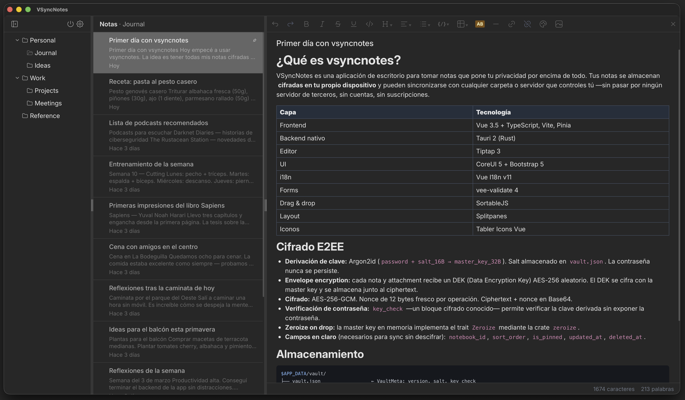
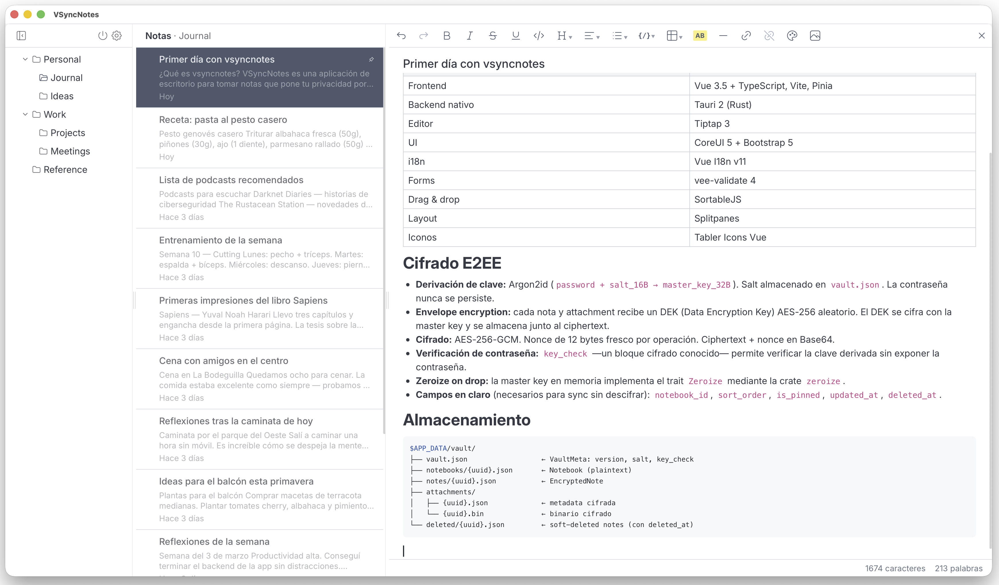

<div align="center">

# 🔐 VSyncNotes

**Private, offline-first notes with end-to-end encryption and multi-device sync.**

[](LICENSE)
[](https://tauri.app)
[](https://vuejs.org)
[](README_ES.md)

 

</div>

⬇️ **[Download for macOS — Latest Release](https://github.com/masweb/vsyncnotes/releases/latest)**

---

## What is vsyncnotes?

vsyncnotes is a desktop note-taking application that puts your privacy above all else. Your notes are stored **encrypted on your own device** and can be synced to any folder or server you control — without passing through any third-party servers, no accounts, no subscriptions.

---

## Features — commercial overview

### Write without limits

A full rich-text editor with support for bold, italic, strikethrough, underline, headings (H1–H6), bullet lists, numbered lists, task lists (checkboxes), code blocks with syntax highlighting for over a dozen languages, tables, blockquotes, horizontal rules, text color, and images. Everything you need to capture ideas with real formatting, not just plain text.

### Organize with nested notebooks

Create a notebook hierarchy as deep as you need. Drag and drop notes and notebooks to reorganize them. Pin the most important notes to the top of the list. Each note shows a content excerpt so you can identify it at a glance without opening it.

### Find anything instantly

Search goes beyond titles: it searches the **full content** of all your notes. Search is incremental — results appear as you type, with partial word matching. It also searches notebook names. Navigate with the keyboard (arrow keys, Enter) to open a result without using the mouse.

### Sync wherever you want, no accounts

Choose your sync method:

- **Local or network folder** — any folder you have access to: an external drive, a mounted NAS directory, or a Dropbox / Google Drive folder managed by their desktop client.
- **WebDAV** — any standard WebDAV server. Enter the URL, username, and password.
- **Nextcloud** — enter your server URL and sync configures itself.

Sync is bidirectional, incremental, and fault-tolerant. You can use it in automatic mode (configurable interval) or manual. Works seamlessly for sharing notes between your own devices.

### Your privacy, guaranteed

Every note is encrypted **before writing to disk** with AES-256-GCM. Your password is never stored: it's used to derive the master key via Argon2id. When you sync, encrypted files travel as-is — your sync server never sees the content. Lock the vault with one click and all sensitive information disappears from memory instantly.

### Trash with 30-day recovery

Deleted notes don't disappear immediately: they go to the trash and you can recover them at any time within 30 days. After that, they are permanently and automatically deleted. The trash shows the note count at all times.

### Clean and fast interface

Three-column layout: notebook tree, note list, editor. Resizable panels. Light and dark themes. Available in Spanish and English. Keyboard shortcuts: ⌘F to search, ⌘N for new note, ⌘NN for new notebook.

---

## Features — technical overview

### Stack

| Layer | Technology |
|-------|-----------|
| Frontend | Vue 3.5 + TypeScript, Vite, Pinia |
| Native backend | Tauri 2 (Rust) |
| Editor | Tiptap 3 |
| UI | CoreUI 5 + Bootstrap 5 |
| i18n | Vue I18n v11 |
| Forms | vee-validate 4 |
| Drag & drop | SortableJS |
| Layout | Splitpanes |
| Icons | Tabler Icons Vue |

### E2EE encryption

- **Key derivation:** Argon2id (`password + salt_16B → master_key_32B`). Salt stored in `vault.json`. Password is never persisted.
- **Envelope encryption:** each note and attachment gets a random AES-256 DEK (Data Encryption Key). The DEK is encrypted with the master key and stored alongside the ciphertext.
- **Encryption:** AES-256-GCM. Fresh 12-byte nonce per operation. Ciphertext + nonce in Base64.
- **Password verification:** `key_check` — a known encrypted block — allows verifying the derived key without exposing the password.
- **Zeroize on drop:** the in-memory master key implements the `Zeroize` trait via the `zeroize` crate.
- **Cleartext fields** (needed for sync without decrypting): `notebook_id`, `sort_order`, `is_pinned`, `updated_at`, `deleted_at`.

### Storage

```
$APP_DATA/vault/
├── vault.json                  ← VaultMeta: version, salt, key_check
├── notebooks/{uuid}.json       ← Notebook (plaintext)
├── notes/{uuid}.json           ← EncryptedNote
├── attachments/
│   ├── {uuid}.json             ← encrypted metadata
│   └── {uuid}.bin              ← encrypted binary
└── deleted/{uuid}.json         ← soft-deleted notes (with deleted_at)
```

The `StorageRepo` trait abstracts storage. `FsRepo` implements it over the filesystem with async operations (`tokio::fs`).

Fast-path operations without decryption: `note_set_sort_order` and `note_set_pinned` read the JSON as `serde_json::Value` and patch the target field — without touching encryption.

### Full-text search (Tantivy)

- **RAMDirectory** index from [Tantivy](https://github.com/quickwit-oss/tantivy) built when unlocking the vault. Not persisted to disk — cleartext never leaves memory.
- Schema: `id` (STRING+STORED), `notebook_id` (STRING+STORED), `title` (TEXT+STORED), `body` (TEXT), `updated_at` (STORED).
- Text extraction from Tiptap JSON body: recursive `tiptap_text()` function that traverses the node tree.
- **Prefix matching:** for each query token, a `RegexQuery` with pattern `^{token}.*` is built over `title` and `body`. Tokens are combined in a `BooleanQuery` with `Occur::Should` across fields and `Occur::Must` across words.
- Index is updated incrementally when saving or deleting notes (`tantivy_upsert_note`).
- When locking the vault, the index is discarded and replaced with a new empty one.
- Notebooks are searched in the frontend via a `computed` over `notebookStore.notebooks` (plaintext, no network cost).

### Synchronization

`SyncEngine` manages three providers under the same interface:

**Filesystem (`do_sync_fs`):**
1. Push phase: iterates local files, compares `updated_at` from plaintext JSON with the remote. If local is newer or remote doesn't exist → `copy_atomic` to target.
2. Pull phase: iterates remote `.json` files, copies those not present locally.
3. `vault.json`: compared by content (bytes). Remote wins if different → `vault_updated: true`.

**WebDAV / Nextcloud (`do_sync_webdav`):** same logic with an HTTP client (reqwest) using PROPFIND for listing, GET/PUT for transferring. Nextcloud builds the WebDAV URL automatically from the base server URL.

**Atomic writes (`copy_atomic`):**
```
read(src) → assert !empty → write(dst.tmp) → rename(dst.tmp → dst)
```
`rename` is atomic on all OSes and bypasses `EPERM` on existing files owned by another user (only requires write permission on the parent directory).

**Frontend (syncStore):**
- `beforeSyncHook`: the editor registers `flushSave` on mount. `runSync` invokes it before `api.syncRun()` to ensure the latest change is on disk.
- If `vault_updated: true` → `vault_lock()` + `setView('unlock')` (re-derives master key with the new remote salt).
- If `pulled > 0` → reloads `notebookStore` + `noteStore` and, if the active note was updated, `forceReloadNote()`.

### Editor (Tiptap 3)

Active extensions:

| Extension | Function |
|-----------|----------|
| StarterKit | Bold, italic, headings, lists, blockquote, code, HR |
| Underline | Underline |
| Highlight | Text highlight |
| Color | Text color (16 predefined colors) |
| TextAlign | Alignment L/C/R/J |
| Link | Hyperlinks with edit modal |
| Image (custom) | Images via vsync:// attachment |
| TaskList + TaskItem | Checklists |
| Table + Row/Cell/Header | Tables with row/column controls |
| CodeBlockLowlight | Syntax highlighting (lowlight/common) |
| Placeholder | Hint text on empty note |
| CharacterCount | Character and word counter |
| History | Undo/Redo |

**Images as attachments:**
- File selection → `attachment_save(note_id, filename, mime, bytes)` → backend generates DEK, encrypts, stores `.bin`.
- Tiptap node stores `src="vsync://attachment/{uuid}"`.
- `ImageNodeView.vue` resolves the URI `onMounted`: calls `attachment_get(id)` → `URL.createObjectURL(blob)`.

**Auto-save:** 1.5 s debounce via `scheduleSave` / `flushSave`. Status indicator: `Saved / Saving... / Unsaved`. Orphan attachment cleanup on note change.

**Native context menu:** `Menu.popup()` from `@tauri-apps/api/menu` with `PredefinedMenuItem` (Cut/Copy/Paste), `CheckMenuItem` (spellcheck), `MenuItem` (Read aloud via Web Speech API).

### Data models

```typescript
Notebook   { id, parent_id?, title, sort_order, created_at, updated_at }
Note       { id, notebook_id, title, body: TiptapJSON, body_format, sort_order, is_pinned, created_at, updated_at }
NoteMeta   { id, notebook_id, title, snippet?, sort_order, is_pinned, created_at, updated_at }
Attachment { id, note_id, filename, mime, size_bytes, hash_sha256, created_at, updated_at }
DeletedNoteMeta { id, notebook_id, title, deleted_at, updated_at }
NoteSearchResult { id, notebook_id, title, updated_at }
SyncConfig { provider, target_path?, webdav_url?, webdav_username?, webdav_password?, auto_sync_interval_secs }
SyncResult { pushed, pulled, skipped, errors[], vault_updated, pulled_note_ids }
```

### Tauri commands

| Command | Signature |
|---------|-----------|
| `vault_create` | `(password) → ()` |
| `vault_unlock` | `(password) → ()` |
| `vault_lock` | `() → ()` |
| `vault_change_password` | `(old, new) → ()` |
| `vault_status` | `() → VaultStatus` |
| `notebooks_list` | `() → Vec<Notebook>` |
| `notebook_get` | `(id) → Notebook` |
| `notebook_create` | `(title, parent_id?) → Notebook` |
| `notebook_update` | `(notebook) → ()` |
| `notebook_delete` | `(id) → ()` |
| `notes_list` | `(notebook_id) → Vec<NoteMeta>` |
| `note_get` | `(id) → Note` |
| `note_create` | `(notebook_id, title) → Note` |
| `note_update` | `(note) → ()` |
| `note_delete` | `(id) → ()` |
| `note_set_sort_order` | `(id, sort_order) → ()` |
| `note_set_pinned` | `(id, pinned) → ()` |
| `attachment_save` | `(note_id, filename, mime, data) → Attachment` |
| `attachment_get` | `(id) → Vec<u8>` |
| `attachment_delete` | `(id) → ()` |
| `search_notes` | `(query) → Vec<NoteSearchResult>` |
| `trash_list` | `() → Vec<DeletedNoteMeta>` |
| `trash_restore` | `(id) → ()` |
| `trash_purge` | `(id) → ()` |
| `trash_empty` | `() → ()` |
| `sync_configure` | `(provider, interval, ...) → ()` |
| `sync_get_config` | `() → Option<SyncConfig>` |
| `sync_clear_config` | `() → ()` |
| `sync_run` | `() → SyncResult` |
| `sync_webdav_test` | `(url, user, pass) → ()` |

### Development

```bash
# Install dependencies
pnpm install

# Dev with hot-reload
pnpm dev:tauri

# Production build
pnpm build:tauri
```

**Requirements:** Rust (latest stable), Node 20+, pnpm, Xcode Command Line Tools (macOS).

---

## Project status

| Phase | Status |
|-------|--------|
| 0 — Tauri 2 + Vue 3 bootstrap | ✅ |
| 1 — Models + filesystem CRUD | ✅ |
| 2 — E2EE encryption (AES-256-GCM + Argon2id) | ✅ |
| 3 — UI: layout, tree, list, editor | ✅ |
| 4 — Attachments (images in notes) | ✅ |
| 5 — Full-text search (Tantivy RAM) | ✅ |
| 6 — Filesystem + WebDAV + Nextcloud sync | ✅ |
| 7 — Trash with 30-day auto-purge | ✅ |
| — | — |
| Tags and filters | 🔲 |
| Export / Import (Markdown, Joplin) | 🔲 |
| S3 / Dropbox sync | 🔲 |
| Editor plugins | 🔲 |
